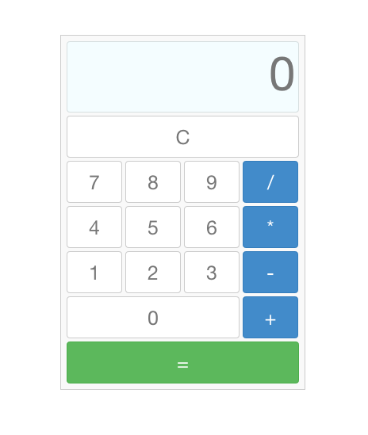

## Simple Calculator App - AngularJS, Bootstrap CSS

- Performs 4 arithmetic operations
- Equals sign button evaluates and displays the result of the inputed numbers and the selected operation
- Clear button resets calculator to zero
- Built with Angular.js and Bootstrap.css
- [See working example](http://brentswain.com/calculator/app/)

